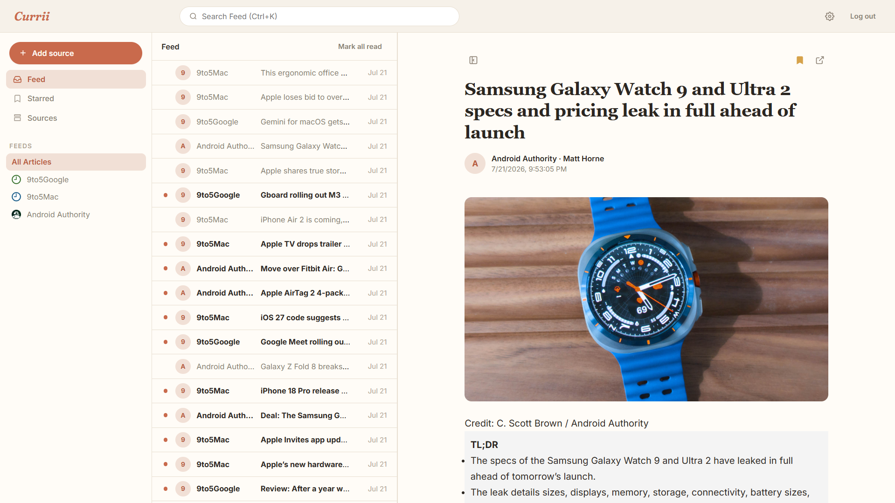

  
  # CURRII

  **RSS READER // AGGREGATOR // READING LIST //**
  

A minimal, self-hosted RSS/Atom reader. Follow any feed by URL, read distraction-free, and keep a bookmarked reading list — with a guest mode for trying it out before creating an account.

---

## Features & Recent Updates

**Reading**
* **Universal Feed Add:** Drop in any site or feed URL — Currii auto-detects RSS/Atom, pulls the title, favicon, and site link, and starts tracking it.
* **Unified Feed:** All subscriptions merge into one chronological list, filterable by source or by search term.
* **Full-Article Fetch:** When a feed only publishes a short excerpt, opening the article fetches and caches the full readable page on demand.
* **Read/Unread & Bookmarks:** Track what's been read automatically, star anything to save it to a personal reading list, and mark everything read in one click.

**Guest Mode**
* Browse and add sources with zero signup — a temporary session-only feed list that never touches the database. Registering later unlocks bookmarks, notifications, and saved preferences.

**Sources**
* **Source Manager:** Add, remove, and organize feeds into categories, with per-source health tracking (Online / Offline / Invalid) and manual refresh.
* **Shared Feed Cache:** Feeds are fetched and parsed once and shared across all subscribers, not re-parsed per user.

**UI / UX**
* Collapsible feed list, light/dark/system theme, adjustable font scale, and a keyboard-driven command palette.
* OLED-friendly monochrome design with a compact, single-line article list where titles get priority space over preview text.

---

## Installation (Laragon)

1. Place the `currii` folder inside your Laragon `www` directory, e.g. `C:\laragon\www\currii`. If you already have another project in `www`, just make sure the folder name `currii` doesn't collide with it.
2. Open phpMyAdmin (or the Laragon MySQL terminal) and import `database/schema.sql`. This creates the `currii` database and its tables — no seed data is required.
3. Start Apache and MySQL in Laragon.
4. Visit `http://localhost/currii/public/` or `http://currii.test` if Laragon's auto virtual hosts are enabled.

## Getting Started

There are no demo accounts — Currii has no seed data. Instead:
* Click **Continue as Guest** to try the app immediately with a temporary, session-only source list.
* Or **create an account** with a username (3–30 characters, letters/numbers/underscores/periods) and a password (min. 8 characters) to persist subscriptions, bookmarks, and preferences.

## Security Notes

- Every API action is guarded by `Security::requireAuth()` (registered users or active guests) or `Security::requireRegistered()` (registered users only, e.g. bookmarks and notifications).
- All queries built from user input use PDO prepared statements to prevent SQL injection.
- Passwords are hashed with Argon2id (falling back to bcrypt) via `password_hash()` and verified with `password_verify()`.
- Sessions are regenerated on login to prevent fixation, and state-changing requests are protected with a per-session CSRF token.
- Login and registration are rate-limited per session to slow down brute-force attempts.
